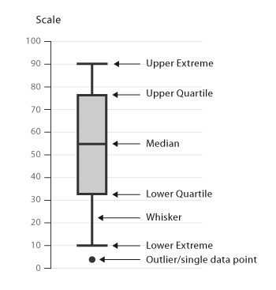

# Installing Packages {.tabset .tabset-fade .tabset-pills}

## Install data.table
Before we start work with tables, let's install the `data.table` package which we shall use heavily:
```{r}
# Installs data.table
# install.packages("data.table")
# Loads the package
library(data.table)
```

## Installing dplyr
Before we start manipulating data let's install the `dpylr` package:
```{r}
# Installs dplyr
# install.packages("dplyr")
# Loads the package
library(dplyr)
```

## Installing ggplot2
We will use this package for data visualisation:
```{r}
# Installs ggplot2
# install.packages("ggplot2")
# Loads the package
library(ggplot2)
```

# Import/Export Data {.tabset .tabset-fade .tabset-pills}

## Read Tables
Within RStudio in the top right corner one can import a dataset from the Enivronment Pane. Alternatively, one can navigate to `File > Import Dataset`. Aside from using RStudio's native UI there are built-in functions and packages that enable you to import datasets into R. Let's try importing the data present in a particular path and make use of the `View(...)` function of RStudio: 
```{r}
# Import CSV (relative path) into a dataframe
titanic_df <- read.csv("../Data/train.csv")
# Converts it to a data table
titanic_df <- data.table(titanic_df)
# Check the data
titanic_df
```
If you recieved an error it's probably because you didn't download the github repository. There are two causes for the error:
- you probably didn't replicate the folder structure that I have
- or, you didn't set a working directory
The following code will help you resolve the error:
```{r}
# Importing data using the absolute path
# titanic_df <- read.csv("your-path-here/train.csv")
# Setting a working directory
# setwd("your-path-here/BeginR/Code")
# View the data
# View(titanic_df)
```

## Write tables
Let's write a table to our laptops now:
```{r}
# Create a table
df <- data.frame(names = c("X","Y","Z"),
                 gender = c("Male","Female","Female"),
                 score = c(67, 99, 85))

# Writing to a table without the rownames
write.csv(x = df, file = "../Code/something.csv", row.names = FALSE)
```


# Understanding the Data {.tabset .tabset-fade .tabset-pills}

## Structure of data
Let's explore the structure of the data:
```{r}
# Structure of the data
str(titanic_df)
```
Most variable names are not illuminating. So let's understand the data description from the source:

Variable Name | Description
--------------|-------------
Survived      | Survived (1) or died (0)
Pclass        | Passenger's class
Name          | Passenger's name
Sex           | Passenger's sex
Age           | Passenger's age
SibSp         | Number of siblings/spouses aboard
Parch         | Number of parents/children aboard
Ticket        | Ticket number
Fare          | Fare
Cabin         | Cabin
Embarked      | Port of embarkation

## Summary statistics of data
```{r}
# Displays the summary of all variables in the dataframe
summary(titanic_df)
```


# Data Manipulation and Viz {.tabset .tabset-fade .tabset-pills}

## Missing values
Note here that `Age` has 177 `NA`'s. Also, `Embarked` has 2 observations with `""` as entries. This implies that there is missing data. In most cases, there will be some sort of imputation that happens for variables. First let's learn to retrieve a subset of the data using the `filter(...)` function:
```{r}
# Filter the "" in Embarked
filter(titanic_df, Embarked == "")
```
Let's see if we can remove these two observations from our data:
```{r}
# Filter the "" in Embarked
titanic_df <- filter(titanic_df, !Embarked == "")
titanic_df
```
The row count decreased by 2 so we have correctly removed the missing observations for `Embarked`. But in the case of `Age` we cannot simply remove 177 observations from our data. Similarly, there seem to be missing values in `Cabin`:
```{r}
# Displays the first 5 rows
head(titanic_df)
```
How many missing values are there in both `Age` and `Cabin` combined?
```{r}
filter(titanic_df, Cabin == "")
```
Wow, 687 rows without any information for `Cabin`, this means that the data in this column is extremely sparse.
Well, let's look at other insights our data can provide because imputing missing values is out of scope for this workshop.

## Investigation I
**Are there several family names and do the ticket fares differ for them?**

Let's create another variable called `Surname` using `srtsplit(...)` to split `Name` and apply that function on every row in the table using `sapply(...)`:
```{r}
# Splits every Name based on ',' or '.'
titanic_df$Surname <- sapply(titanic_df$Name, 
                             function(x) {
                                 strsplit(as.character(x), 
                                          split = '[,.]')[[1]][1]
                                 }
                             )
# Display the table
titanic_df
```
Let's group the surnames using the `group_by(...)` function and then use the `summarise(...)` function to generate an understanding on classism and family names:
```{r}
# Group the data based on surnames
grouped_surnames <- group_by(titanic_df, Surname)
# Create two columns MeanFare and Total count
summarise(grouped_surnames, MeanFare = mean(Fare), Total = n())
```
Well frankly, this investigation hasn't revealed anything useful. More often than not, it's important to ask the right questions. Let's try something simpler.

## Investigation II
**Do families sink or swim together?**

We're going to make a `family size` variable based on number of siblings/spouse(s) (maybe someone has more than one spouse?) and number of children/parents.
```{r}
# Create a family size variable including the passenger themselves
titanic_df <- mutate(titanic_df, Fsize = SibSp + Parch + 1)
# Display the result
titanic_df
```
What does our family size variable look like? To help us understand how it may relate to survival, let's plot it using the `geom_bar(...)` function:
```{r}
# Use ggplot2 to visualize the relationship between family size & survival
# geom_bar() plots a bar chart
ggplot(titanic_df, aes(x = Fsize, fill = factor(Survived))) + 
    geom_bar(position = 'dodge') + 
    scale_x_continuous(breaks = 1:11)
```
We can see that there’s a survival penalty to singletons and those with family sizes above 4.

## Investigation III
Before we investigate another phenomenon let's review what a box-whisker plot is.



**Do the Fares of the passengers vary due to Passenger Class and Port of Embarkment?**

Here I will also introduce the pipe `%>%` operator. Think of it as a machine that takes the result of the function to the left of it and passes it as an argument to the function on the right.
```{r}
# Group the data on Embarked and Pclass
titanic_df %>%
    group_by(Embarked, Pclass) %>%
    summarise(meanF = mean(Fare), medianF = median(Fare), maxF = max(Fare), Count = n())
```
Well, visualizing numerical data is powerful tool in understanding the spread of the data and more importantly the outliers. Let's plot these values using the `geom_boxplot(...)` function:
```{r}
# geom_boxplot() plots a boxplot
ggplot(titanic_df, aes(x = Embarked, y = Fare, fill = factor(Pclass))) +
  geom_boxplot()
```
We can see there are some clear outliers here. Moreover, Q2 and Q3 seem to be the cheapest tickets.

## Investigation IV
**What factors could possibly influence survival rates ?**

We examine the correlation (standardised covariance) which is calculated by the formula $Cov(X,Y) = E(XY) - E(X)E(Y)$ for numerical vectors:
```{r}
# Convert categorical variables to numerical, select those columns and calculate correlation
cor_df <- titanic_df %>%
    mutate(SexN = as.numeric(Sex), EmbarkedN = as.numeric(Embarked)) %>%
    select(Survived, EmbarkedN, Pclass, SexN, SibSp, Parch, Fsize, Fare) %>%
    cor()
# Display the data
cor_df
```
Next we create a `melt(...)` the correlation matrix into the long form:
```{r}
# Melts the dataframe
output <- melt(cor_df)
# Display
output
```
Let's visualise the correlation using the `geom_tile(...)` function:
```{r}
# geom_tile() plots a correlation matrix
ggplot(output, aes(x=Var1, y=Var2, fill=value)) + 
    geom_tile()
```

**Correlation is not Causation** but:

 - There seems to be a high positice correlation between `SibSp`, `Parch` and `Fsize`. What is the reason for this ?
 - There is a negative correlation between `SexN` and `Survival`. It suggests that one sex was more likely to survive. But which one is it ? Can you infer from `str(titanic_df)`
 - What other things can you see ?

## Investigation V
**Does the `Fare` follow a normal distribution ?**

Most random variables in nature follow a normal distribution. Let's find out density plot of the `Fare` variable using the `geom_density(...)` function:
```{r}
# geom_density() plots a density plot
ggplot(titanic_df, aes(x = Fare)) + geom_density()
```
Here's a some code to get the density values which uses all the tables operations we learnt so far. Make sure to experiment with every line in the code below:
```{r}
density_values <- titanic_df %>%                    
    group_by(Fare) %>%                               # Groups the data by Fare
    summarise(Frequency = n()) %>%                   # Generetes frequency of Fare
    mutate(Density = Frequency/sum(Frequency)) %>%   # Creates a column Density
    select(Fare, Density)                                  # Outputs the Density column only
# Display density_values
density_values

```
